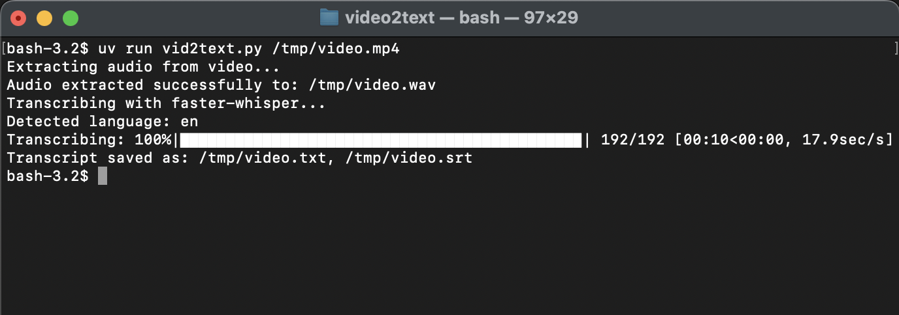

# Video Transcriber using faster-whisper

## Objective

This Python script automates the process of transcribing audio from video files using the `faster-whisper` library. It extracts the audio track from a given video file, transcribes it using a specified Whisper model, and saves the transcript in both plain text (.txt) and timestamped srt-like (.srt) formats.

## Getting Started

```bash
brew install ffmpeg
git clone https://github.com/facha/video2text.git
cd video2text 
uv run vid2text.py /tmp/video.mp4
```


